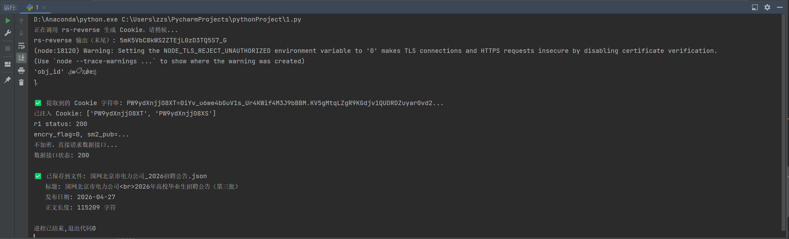
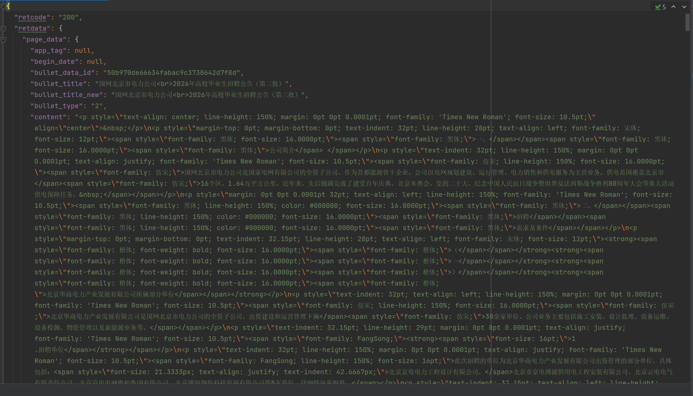

## 项目简介

针对国网北京市电力公司招聘公告页面，逆向分析其多层加密校验机制，使用 SM2/SM3/SM4 国密算法还原请求参数构造流程，实现公告数据的自动化采集。

## 技术栈

- Python
- Requests
- gmssl（SM2/SM3/SM4 国密算法）
- 逆向工程
- subprocess 自动化调用

## 功能说明

- 自动调用 rs-reverse 工具生成动态 Cookie
- 逆向分析接口的 SM2 公钥获取流程，解析 encry_flag 标志位
- 使用 SM3 生成签名、SM4 加密数据、SM2 加密随机密钥
- 实现多层加密请求的构造与响应解密
- 将采集结果保存为结构化 JSON 文件

## 运行方式

1. 安装依赖：`pip install requests gmssl urllib3`
2. 安装 Node.js 环境（用于 rs-reverse）
3. 运行：`python 国网北京市电力公司爬取.py`
4. 结果自动保存为 `国网北京市电力公司_2026招聘公告.json`

## 运行结果

